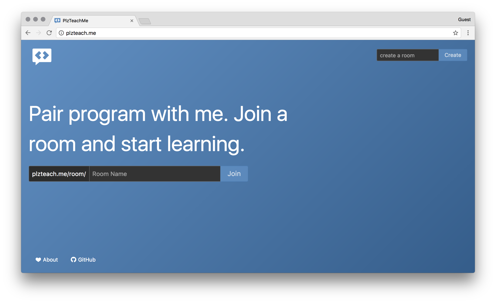
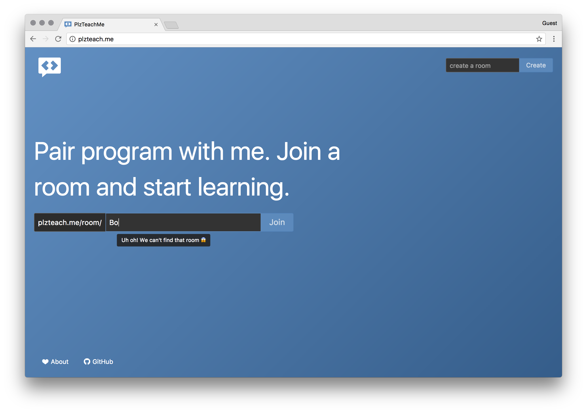
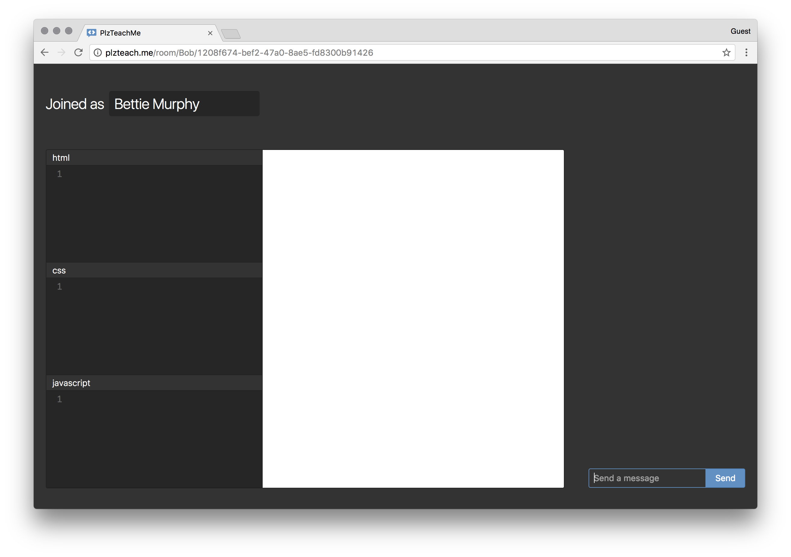
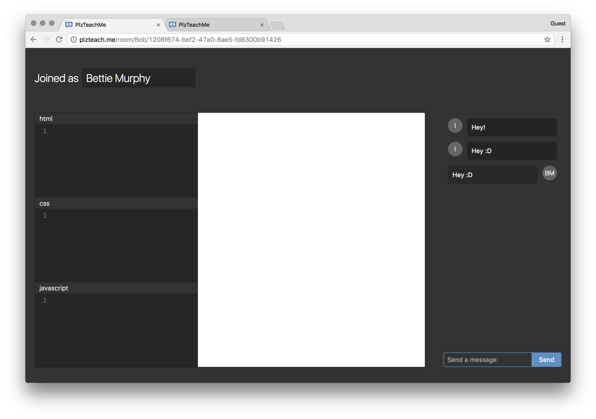
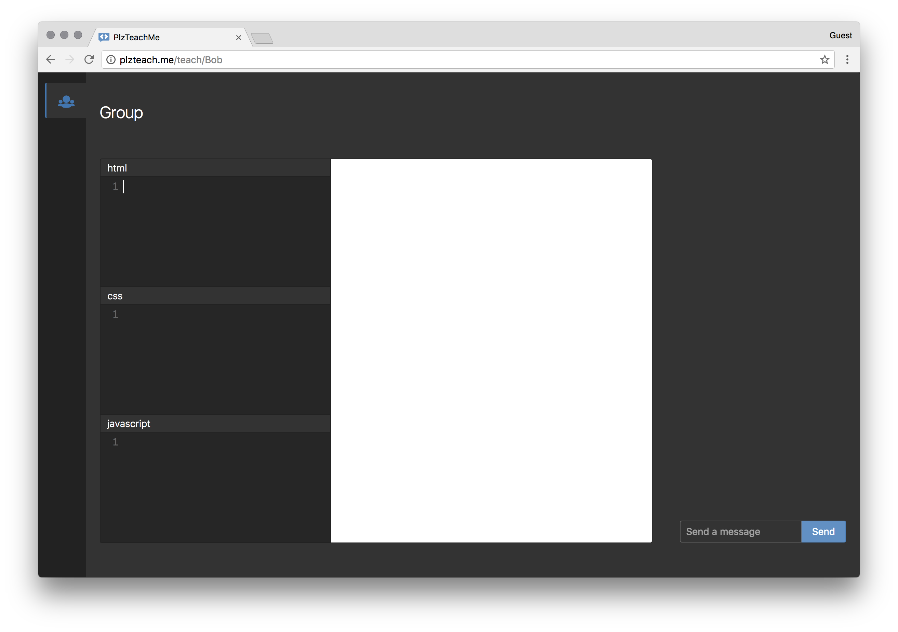
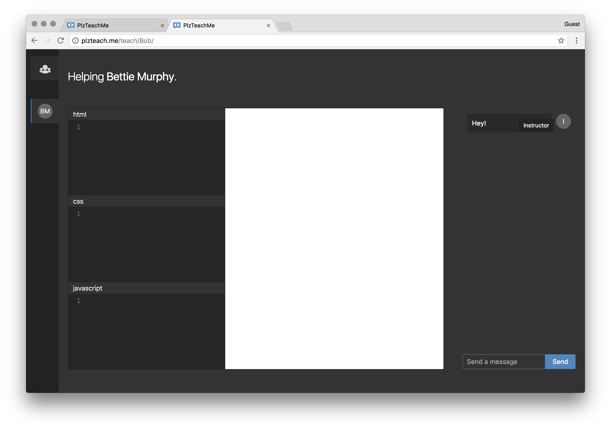
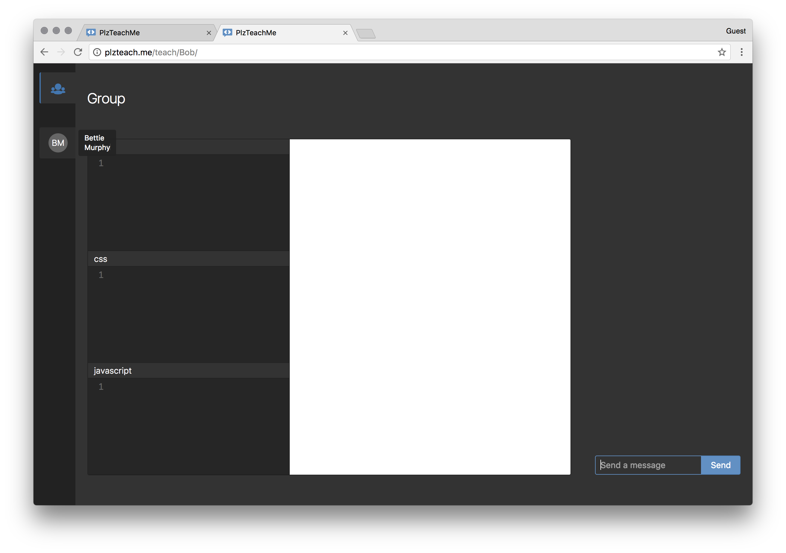

# PlzTeachMe

This is a web app designed to help coders pair program. 

## Walkthrough 

Home Page: 

Create A Room: 

Join A Room: 

Student Room: 

Student Room with Chat:

Teaching Room: 

Teaching Room with Chat: 

Teaching Room Group: 

Teaching Room Help: 

## Authors

* Brynn
* Jake
* Dominique

## Awards

Top 10 at Penn Apps 2017 

## Links

* [Website](http://plzteach.me)
* [Devpost](https://devpost.com/software/plzteachme)
* [Youtube Video](https://youtu.be/5IFfr-ggy-8?t=11m55s)
